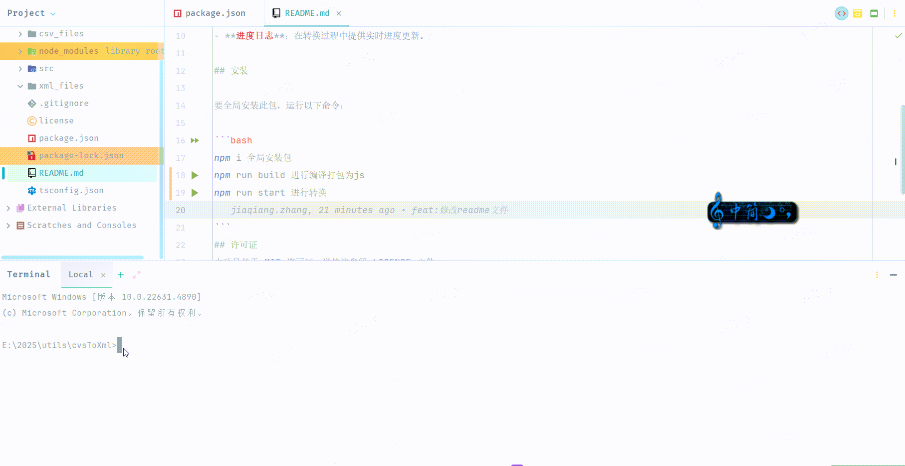

# CSV 转换为 XML 工具

一个用于将CSV文件转换为XML文件的Node.js工具，支持并发和日志记录。

## 功能特色

- **并发控制**：使用 `p-limit` 控制同时处理文件的任务数量。
- **基于流的处理**：通过流高效地处理大型CSV文件。
- **自动输出目录**：生成带有时间戳的XML文件目录。
- **进度日志**：在转换过程中提供实时进度更新。

## 安装

要全局安装此包，运行以下命令：

```bash
npm i 全局安装包
npm run build 进行编译打包为js
npm run start 进行转换

```
## 许可证
本项目基于 MIT 许可证。详情请参阅 LICENSE 文件。

## 支持
如果你遇到任何问题或有疑问，请在 GitHub 上 提交问题。

## 效果图

